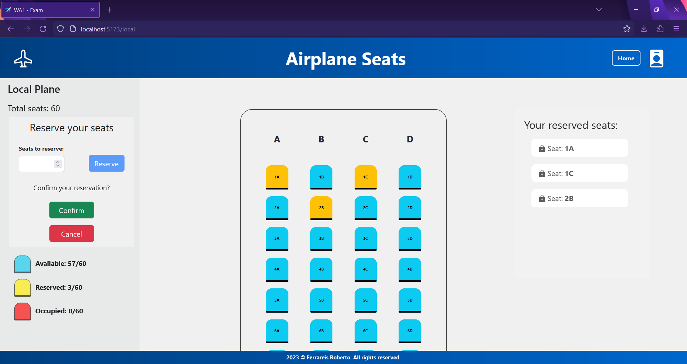

# Exam #2: "Airplane Seats"

## Student: s308271 FERRAREIS ROBERTO

# Server-Side Information

## Server HTTP APIs

### Seats Management

- HTTP method: `GET` URL: `/api/seats`

  - Parameters: `type_id` is the id of the plane type
  - Description: gets only seats related to a specific plane type
  - Request body: _None_
  - Response body: unnamed array of seats objects

    ```JSON
    [
        {
        "id": 1,
        "row_n": 1,
        "line": "A",
        "plane_type": 1,
        "cod_user": null
        },
        ...
    ]
    ```

  - Error responses: `500 Internal Server Error` (generic error)

- HTTP method: `GET` URL: `/api/validate`

  - Parameters: `seat_id` is the id of the seat to check
  - Description: used to check if a seat if available or not
  - Request body: _None_
  - Response body: object containing `cod_user` value

    ```JSON
    {
        "cod_user": null
    }
    ```

  - Error responses: `500 Internal Server Error` (generic error), `401 Unauthorized User` (user is not logged in)

- HTTP method: `PUT` URL: `/api/confirm`

  - Parameters: _None_
  - Description: confirms the booking of a specific seat
  - Request body: `seat_id` is the id of the seat to book

    ```JSON
    {
            "seat_id": 2
    }
    ```

  - Response body: empty object
  - Error responses: `500 Internal Server Error` (generic error), `401 Unauthorized User` (user is not logged in)

- HTTP method: `DELETE` URL: `/api/delete`

  - Parameters: _None_
  - Description: deletes the booking based on plane_type
  - Request body: `plane_type` is the id of the plane considered for deletion

    ```JSON
    {
            "plane_type": 3
    }
    ```

  - Response body: empty object
  - Error responses: `500 Internal Server Error` (generic error), `401 Unauthorized User` (user is not logged in)

### Plane Management

- HTTP method: `GET` URL: `/api/planes`:

  - Parameters: _None_
  - Description: gets all planes information
  - Request body: _None_
  - Response body: unnamed array of plane objects

    ```JSON
    [
      {
        "id": 1,
        "type": "local",
        "rows": 15,
        "seats_per_row": 4,
        "tot_seats": 60
      },
      {
        "id": 2,
        "type": "regional",
        "rows": 20,
        "seats_per_row": 5,
        "tot_seats": 100
      },
      {
        "id": 3,
        "type": "international",
        "rows": 25,
        "seats_per_row": 6,
        "tot_seats": 150
      }
    ]
    ```

  - Error responses: `500 Internal Server Error` (generic error)

### User Authentication and Session Management

#### Login

- HTTP method: `POST` URL: `/api/sessions`

  - Parameters: _None_
  - Description: authenticates the user who is trying to login
  - Request body: credentials of the user who is trying to login

    ```JSON
    {
        "email": "username",
        "password": "password"
    }
    ```

  - Response body: authenticated user

    ```JSON
    {
        "id": 2,
        "email": "mario.rossi@polito.it",
        "name": "Mario"
    }
    ```

  - Error responses: `500 Internal Server Error` (generic error), `401 Unauthorized User` (login failed)

#### Check if user is logged in

- HTTP method: `GET` URL: `/api/sessions/current`

  - Parameters: _None_
  - Description: checks if current user is logged in and get related data
  - Request body: _None_
  - Response body: authenticated user

    ```JSON
    {
        "id": 2,
        "email": "mario.rossi@polito.it",
        "name": "Mario"
    }
    ```

  - Error responses: `500 Internal Server Error` (generic error), `401 Unauthorized User` (user is not logged in)

#### Logout

- HTTP method: `DELETE` URL: `/api/sessions/current`

  - Parameters: _None_
  - Description: logout current user
  - Request body: _None_
  - Response body: empty object
  - Error responses: `500 Internal Server Error` (generic error), `401 Unauthorized User` (user is not logged in)

## Database Tables

- Table `planes` - contains planes information (plane type, number of rows, number of seats per row and total number of seats)

- Table `seats` - contains seats information (row number, line letter, plane type and id of the user who eventually booked the seat)

- Table `users` - contains users credentials (email, name, hashed password and salt)

# Client-Side Information

## React Client Application Routes

- Route `/`: Homepage of the application, contains three selectable cards corresponding to the plane types.
- Route `/login`: Application login page, contains a login box to allow a registered user to authenticate into the application
- Route `/local` : Local airplane page, contains the local airplane seats grid and a sidebar that manages user actions if logged
- Route `/regional`: Regional airplane page, contains the regional airplane seats grid and a sidebar that manages user actions if logged
- Route `/international`: International airplane page, contains the International airplane seats grid and a sidebar that manages user actions if logged
- Route `/*`: Generic route for URL mismatches, it routes to a page not found component

## Main React Components

- `Airplane` (in `Airplane.jsx`): This component manages user actions on planes, it manages visualization if user is not logged and reservation, deletion, cancellation and confirmation of seat bookings if user is logged
- `Sidebar` (in `Sidebar.jsx`): This component shows some information and allows the user to generate a random booking, delete it or confirm it, it only shows information if user is not logged and allows action if user is logged
- `Homepage` (in `Homepage.jsx`): shows the homepage with three cards that are freely selectable, each card shows plane information based on its tipe
- `LoginPage` (in `LoginPage.jsx`): shows and manages a login box to allow user to authenticate
- `Reservation` (in `Reservation.jsx`): lets a logged user to specify a random seats reservation by indicating just the number of seats to reserve
- `Confirmation` (in `Reservation.jsx`): shows a box where a logged user can confirm or cancel a reservation
- `AlreadyBooked` (in `Reservation.jsx`): shows a box with a button used by a logged used that already has a confirmed booking for the shown plane to delete it
- `ReservedSeatsList` (in `ReservedSeatsList.jsx`): shows a box that contains the reservation when a logged user has selected some seats

# Overall Web App Information

## Screenshot

Here a screenshot with the screen for booking the seats, with shown demo, is provided



## Users Credentials

- Here you can find a list of the users already registered inside the provided database.

| Email                       | Name            | Plain-text Password |
| --------------------------- | --------------- | ------------------- |
| roberto.ferrareis@polito.it | Roberto         | password            |
| mario.rossi@polito.it       | Mario           | password            |
| fulvio.corno@polito.it      | Prof. Corno     | password            |
| luigi.derussis@polito.it    | Prof. de Russis | password            |
